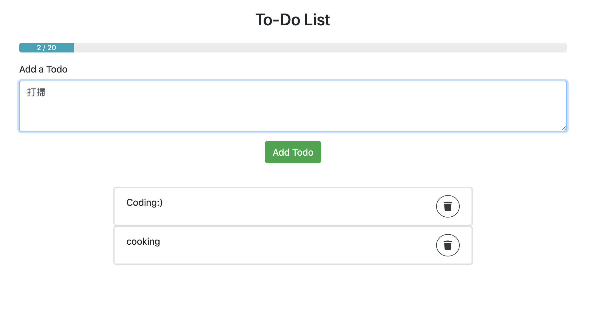

# To-Do List with Vue.js

>  A to-do list with Vue.js 

## Screenshots


## Functionalities
- Add todo
- Delete todo
- Show remaining todos as a progress bar 

## Build Setup

``` bash
# install dependencies
npm install

# serve with hot reload at localhost:8080
npm run dev

# build for production with minification
npm run build
```

For detailed explanation on how things work, consult the [docs for vue-loader](http://vuejs.github.io/vue-loader).
